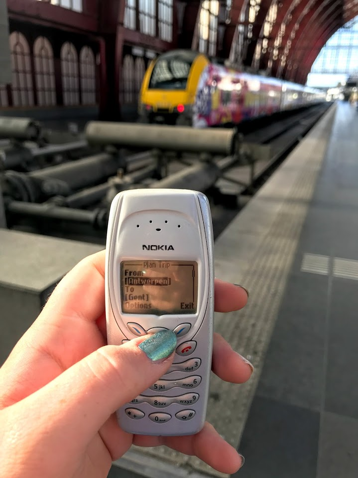
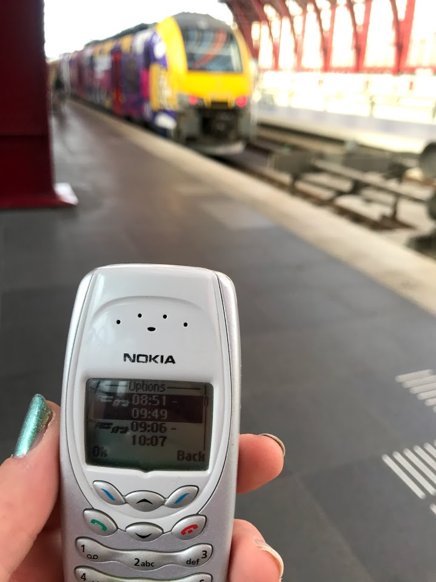
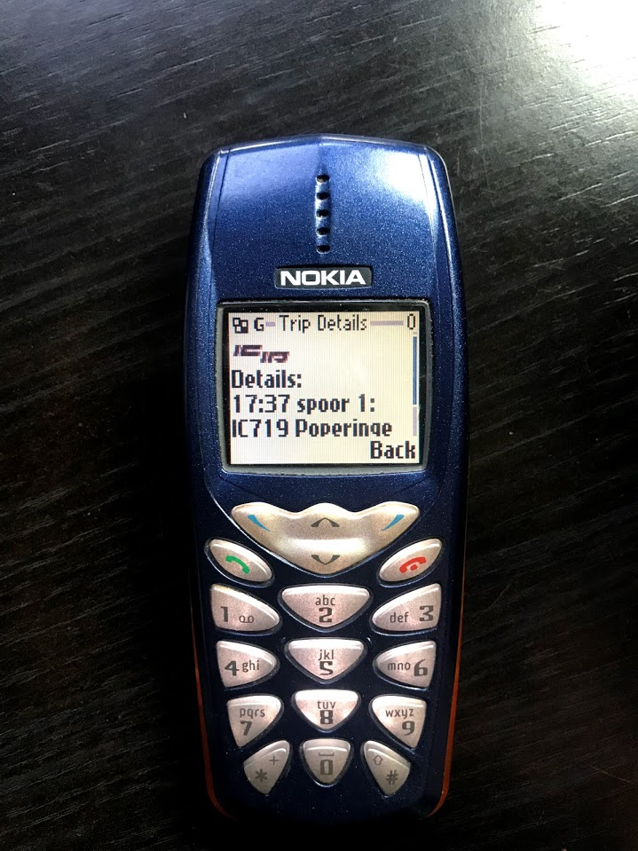
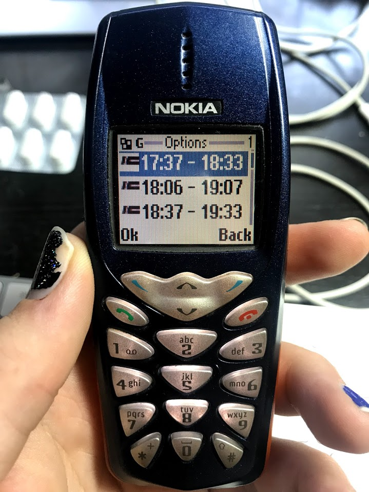

iRail for Nokia
===============
iRail for Nokia is a [NMBS/SNCB](http://thetrain.be) route planner using the [iRail](https://irail.be) data. The app is designed for Nokia 3410 and Nokia 3510i however it might work on other J2ME enabled devices but without guarantees.

## Backend
The app used the [iRail-csv](https://github.com/meyskens/irail-csv) project as data source due to the limitations of the Nokia phones' memory and network.

## Download
You can download a compiled version over WAP at http://nokia.maartje.dev/iRail.jar or http://nokia.maartje.dev/iRail.jad

## App in action
### Screenshots

### Video
* [Running on Nokia 3410 over dial-up](https://youtu.be/rc4FjowrZ5k)
* [Running on Nokia 3510i over GPRS](https://youtu.be/ZqaTVNDl4Sg)
